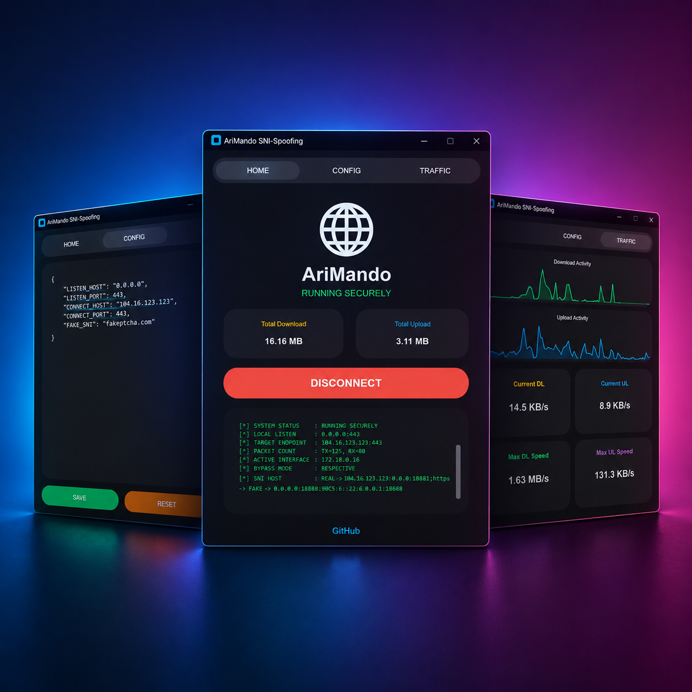

# 🌐 AriMando SNI-Spoofing (Windows)

در این پروژه تلاش شده است روش قدرتمند **SNI-Spoofing** به‌صورت یک اپلیکیشن گرافیکی (GUI)، مدرن و بسیار ساده برای ویندوز پیاده‌سازی شود؛ به‌طوری‌که کاربران بتوانند بدون درگیری با محیط ترمینال، کدهای پیچیده یا قطعی‌های پی‌درپی، با پایداری صددرصد از اینترنت آزاد لذت ببرند.

> 🚀 ابزاری قدرتمند برای عبور از فیلترینگ و سیستم‌های **DPI (Deep Packet Inspection)**
> با استفاده از تکنیک **TCP/IP Header Manipulation (Wrong Seq)** — دارای رابط کاربری اختصاصی و ضد لوپ شبکه!

✨ اینترنت آزاد، پایدار و بدون قطعی برای تمام سیستم و اشتراک‌گذاری روی هات‌اسپات.

---

> [!WARNING]
> **توجه:** این برنامه به تنهایی اینترنت را آزاد نمی‌کند؛ بلکه بسترهای فیلترینگ را دور می‌زند. برای عملکرد صحیح نیاز دارید که یک کلاینت مانند **V2rayN** داشته باشید و کانفیگ‌های کلودفلر (Cloudflare) خود را از طریق پورت لوکال به این برنامه متصل کنید.

---

## 📥 دانلود برنامه

برای استفاده از برنامه:

1. مخزن پروژه را به صورت ZIP دانلود کنید (یا از بخش Releases نسخه `.exe` را دریافت کنید)
2. فایل ZIP را Extract کنید
3. فایل `AriMando.exe` را اجرا کنید

👈 **[دانلود پروژه به صورت ZIP](https://github.com/AriPath/AriMando/archive/refs/heads/main.zip)**

---

## 🧠 سورس پروژه

این مخزن شامل **کد کامل رابط گرافیکی و هسته بهینه‌شده** است:

- 🔧 ترکیب `customtkinter` با هسته قدرتمند `asyncio` و `WinDivert`
- 🛠 مدیریت خودکار Static Route برای جلوگیری از Loop در شبکه
- 🚀 سیستم مانیتورینگ زنده ترافیک به صورت Multi-Thread

---

## ✨ قابلیت‌ها

- 🌐 دور زدن سیستم فیلترینگ بدون افت سرعت (غیرفعال‌سازی الگوریتم Nagle)
- 🔄 **سازگاری کامل با Tun Mode:** دارای سیستم Anti-Loop خودکار؛ بدون هیچ‌گونه تداخلی با V2rayN!
- 📡 **پشتیبانی بی‌نقص از Hotspot:** امکان اشتراک‌گذاری اینترنت آزاد روی موبایل و تلویزیون بدون نیاز به تنظیم پروکسی.
- 📊 نمودارهای داینامیک و زنده ترافیک مصرفی (آپلود/دانلود/سرعت لحظه‌ای)

---

## 🚀 راه‌اندازی سریع

### 👤 مراحل اجرا و اتصال به V2rayN

1️⃣ برنامه `AriMando.exe` را اجرا کنید.  
2️⃣ روی دکمه **CONNECT** کلیک کنید تا هسته شبکه با موفقیت ران شود.  
3️⃣ در کلاینت **V2rayN**، یکی از کانفیگ‌های کلودفلر (Vless یا Trojan) خود را ویرایش کنید:
   - **آدرس (Address):** `127.0.0.1`
   - **پورت (Port):** `40443` (یا پورتی که در بخش Config اریماندو ثبت کرده‌اید)
   - بقیه مقادیر (SNI، Host، Path و...) را تغییر ندهید و دقیقاً مثل کانفیگ اصلی نگه دارید.  
4️⃣ کانفیگ را استارت کنید و از اینترنت آزاد لذت ببرید! 🎉

---

## 📱 استفاده از Tun Mode و هات‌اسپات (بدون پروکسی)

یکی از بزرگترین مزیت‌های **AriMando** حل مشکل تداخل شبکه (Routing Loop) است. شما به راحتی می‌توانید کل سیستم و دستگاه‌های متصل را تونل کنید:

**✅ Tun Mode (تونل کل ویندوز):**
کافیست در V2rayN قابلیت **Tun Mode** را روشن کنید! AriMando به صورت هوشمند مسیرها (Routes) را هدایت می‌کند تا هیچ قطعی رخ ندهد و تمام اپ‌های ویندوز آزاد شوند.

**✅ هات‌اسپات (اشتراک اینترنت با موبایل):**
دیگر نیازی نیست روی وای‌فایِ گوشی خود پروکسی دستی (10808) ست کنید!
1. قابلیت Mobile Hotspot ویندوز را روشن کنید.
2. کلیدهای `Win + R` را بزنید و `ncpa.cpl` را باز کنید.
3. روی آداپتور مجازی V2rayN (که معمولاً اسمش `tun` است) راست‌کلیک کرده و **Properties** بگیرید.
4. در تب **Sharing** تیک اشتراک‌گذاری را بزنید و کارت شبکه هات‌اسپات ویندوز را انتخاب کنید.
5. حالا با هر دستگاهی به وای‌فای لپ‌تاپ وصل شوید، اینترنت ۱۰۰٪ آزاد است!

---

## ⚠️ سلب مسئولیت (Disclaimer)

این پروژه (AriMando) تنها یک **رابط کاربری گرافیکی (GUI)** و ابزار کمکی برای سهولت استفاده کاربران است. **هسته اصلی و منطق دور زدن شبکه (SNI-Spoofing)** توسط توسعه‌دهندگان دیگری (Patterniha) ساخته و منتشر شده است و ما سازنده کد اصلی دستکاری پکت‌های شبکه نیستیم.

این نرم‌افزار منحصراً با هدف **آموزشی** توسعه یافته است. توسعه‌دهندگان AriMando هیچ‌گونه مسئولیتی در قبال استفاده نادرست، غیرقانونی و یا هرگونه سوءاستفاده از این ابزار و کدهای آن توسط اشخاص ثالث نمی‌پذیرند. تمامی عواقب و مسئولیت استفاده از این نرم‌افزار مستقیماً بر عهده شخص کاربر می‌باشد.
